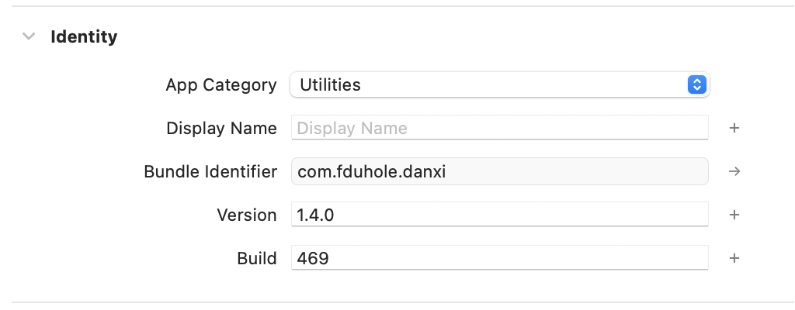
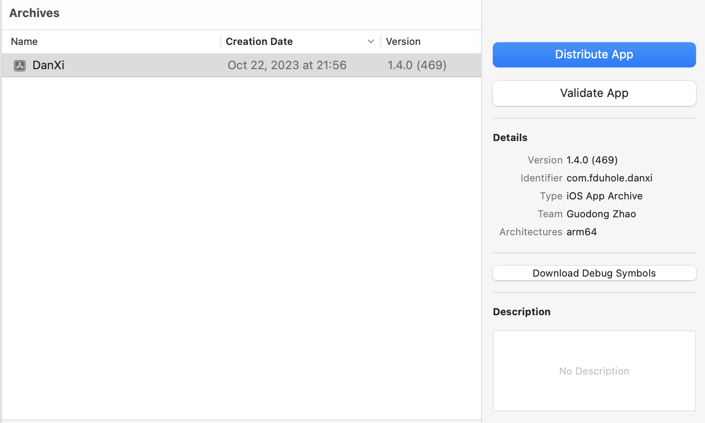
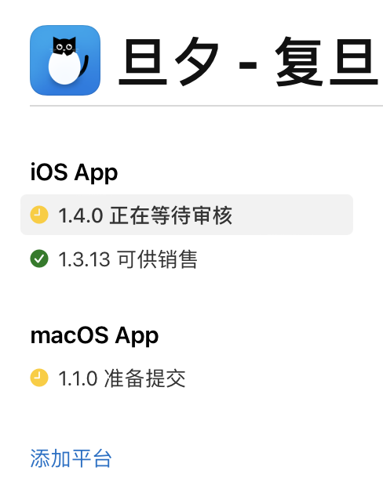

# 发布到 iOS

本文档将简单介绍 iOS App 打包发布的流程。

## 构建和上传

:::caution
上传前应当确认已经在 Xcode 中登录了具有开发权限的 Apple ID，可以在 Settings - Accounts 中检查。
:::

1. 在 Xcode 中打开项目，并在 Target - General 板块中设置 version number 和 build number。

2. 在工具栏中选择合适的 Target 和 Build Scheme，然后点击菜单栏中的 Product - Archive 来执行构建和打包操作。

3. 构建完成后，Xcode 会自动打开 Organizer 窗口。也可以在菜单栏中点击 Window - Organizer 来打开 Organizer 窗口。该窗口中会显示所有的打包完成的 App。

4. 选中刚刚构建完成的 App，然后点击 Distribute App，选择 TestFlight & App Store，然后等待上传完成即可。

## 提交 Apple 审核

1. 打开 App Store Connect 网页的旦夕 App 页面，点击页面上 iOS App 一节下带有“准备提交”字样的链接。

2. 在“构建版本”部分，删除已有的构建版本，并在列表中选择一个新的构建版本。

3. 根据需要，编辑以下信息：
   - 版本（需要和提交的构建版本的版本号一致）
   - 此版本的新增内容
   - 版本发布

4. 编辑完成后，点击“存储”，然后点击“提交至App审核”。